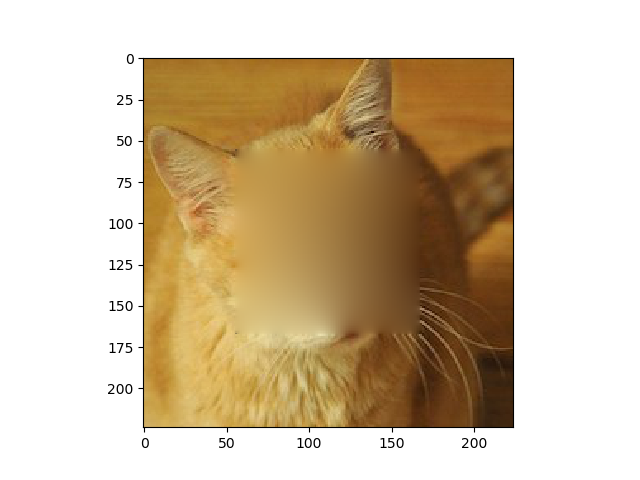

# Poisson Image Completion

## Usage
`python poissonblend.py [image] [-h] [--circle] [--guide] [--debug]`
The mask can be square or circular. Running with no arguments will use a generated striped test image.
