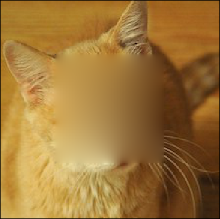

# Poisson Image Completion



## Usage
Run the test applet using
```
python -m poissonblend.blendimage [image] [--circle] [--guide [GUIDE]] [--debug] [--mask MASK]
```
The mask can be square or circular, or a loaded image using the --mask argument. You can also select a guide image whose gradients will be used to fill in the masked region. Running with no arguments will use a generated striped test image.
